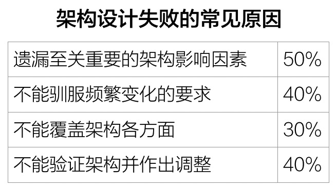
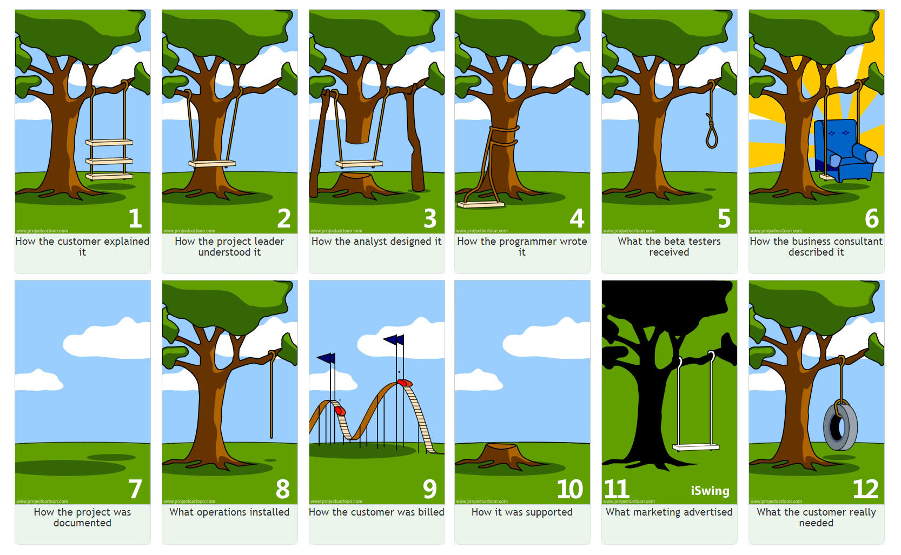
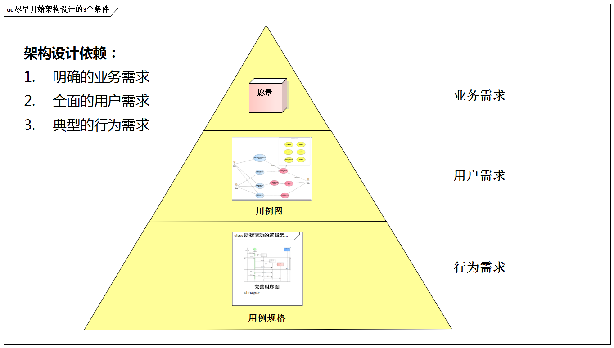

# 3.2. 实际意义

`Pre-architecture`阶段虽然是铺垫性质的阶段，但对架构实践而言意义重大。

## 3.2.1. 需求理解的大局观

架构师常常面对相互矛盾的需求目标。如果对需求的理解缺乏大局观，那将如何进行需求的权衡取舍？

**重大需求塑造概念架构**。如果对需求的理解缺乏大局观，那将如何识别重大需求、特色需求、高风险需求？

`Pre-archiecture`阶段能帮助架构师建立需求理解的大局观。任何需求都可定位与**业务级需求**、**用户级需求**、**开发级需求**这3个需求层次的某一层，同时也必属于**功能**、**质量**、**约束**这3类需求的某一层。

如此一来，就便于梳理脉络、把握关系。

## 3.2.2. 降低架构失败风险

对需求理解不透、遗漏需求往往是架构设计失败的重要原因。在你的身边，一定有类似上一章[3个真实故事](/ch2/README.md)那样的案例。

有一副软件行业自嘲的漫画，讲的是猴子希望得到一串香蕉，收到的却是骨头--这个礼物并不能满足它的真实需求。相信许多人看到这副漫画会苦笑不已。用户经常得不到真正满足他们需求的系统，这已成为整个软件业界一个严峻的问题。

我们无法回避的一个事实：架构师在需求的`理解`、`权衡`、`取舍`和`补充`这几方面能力严重不足。

**从需求转入设计时，因为定制方案过程的复杂性，会激增出大量的衍生需求（针对一种特定设计方案的需求）。设计需求是原始需求的50倍之多。**

`Pre-architecture`阶段将告诉大家，如何告别拙劣的“需求列表”方法（它难道不是遗漏架构影响因素的罪魁祸首吗？），取而代之以`ADMEMS`矩阵方法。

的确，需求是有结构的！由于`ADMEMS`的“二维需求观”体现了更复杂的、更本质的需求结构，所以可以帮助架构师更全面地看待需求、避免遗漏重要的非功能性需求，大大降低架构失败的风险。

## 3.2.3. 尽早开始架构设计

如何尽早开始软件架构设计？这是很多软件企业非常关心的一个问题，因为**大家都深感工期的巨大压力**。

灵活运用`Pre-architecture`阶段的方法，有一个额外的好处：能够在需求没有“全面完成”的情况下开始架构设计。

具体而言，为了尽早开始架构设计，软件企业必须做好以下两点：

- 让架构师参与需求分析工作

实际上，让架构师相对自由的“全程”参与需求分析工作--甚至可以不为任何具体的需求捕获、需求分析、需求文档工作负责

- 不能被动等待完善的产品需求

建议架构师在参与需求分析工作是，不断运用`ADMEMS`矩阵等工具对需求进行大局的梳理，只要满足下列3个条件，就可以尽早开始进行架构设计工作。

1. **有了明确的业务需求。**必须保证甲、乙双方就建设系统的目标（可能不止一项）达成共识，《愿景文档》经过了正式评审，并明确了投资、工期标准、整合等约束条件。试想，业务需求含糊不清，架构设计方向如何确定呢？
2. **了解全面的用户需求**。也就是说，系统能帮助用户干什么、不能干什么，这个“需求的`Scope`”已经非常明确了。如果采用了用例技术，则表现为“用例图”是比较完善的，没有明显遗漏
    > 注意用例图和用例规约在需求分析中的实践意义不同，可参考《软件架构设计》一书
3. **有了典型的行为需求**。这意味着，大量需求还未明确定义，离提交《软件需求规格说明书》还早。如果采用用例技术，则表现为核心功能的《用例规约》已定义。

## 3.2.4. 明确架构设计的“驱动力”

架构设计的“驱动力”不就是《软件需求规格说明书》吗？这种观点，只对了一半。

- 问题1：试想，《软件需求规格说明书》中几乎**没有定义非功能性需求**（客户也签字了），架构设计师就可以不考虑非功能性需求了吗？
- 问题2：试想，**需求变更难以避免**，如果以所有需求作为架构设计的“驱动力”会是什么结果？
- 问题3：试想，《软件需求规格说明书》中**照抄了《ISO 9126》中所有的质量属性要求**，架构师应该不计成本，不分重点的全部支持吗？

上面是3个问题，都是日常工作中常见的问题，都说明架构师还需要关注其他很多因素，最终或添加、或减少、或折衷，理性的确定真正的架构设计“驱动力”。

具体而言，`Pre-architecture`阶段将告诉我们不辱使命的方法：

1. **分析业务需求和约束背后的衍生需求**--针对问题1.
2. **发现遗漏需求**--针对问题1.
3. **确定关键功能**--针对问题2.
4. **确定关键质量**--针对问题2.
5. **权衡质量属性之间矛盾关系**--针对问题3.
