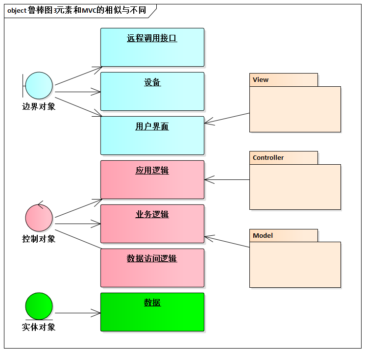

# 8.2. 鲁棒图简介

ADMEMS推荐以鲁棒图来辅助初步设计。那么，什么是鲁棒图呢？

## 8.2.1. 鲁棒图的3种元素

鲁棒图包含3中元素，它们分别是边界对象、控制对象、实体对象。

- 边界对象对模拟外包环境和未来系统之间的交互进行建模。边界对象负责接收外部输入，处理内部内容的解释，并表达或传递相应的结果。
- 控制对象对行为进行封装，描述用例中事件流的 控制行为。
- 实体对象对新鲜进行描述，它往往来自领域概念，和领域模型中的对象有良好的对应关系。

因为“类比思维”在人的头脑中是根深蒂固的，关于鲁棒图3元素的“类比”，自然是MVC。我们做了全面的对比，两者之间还是有不小的差异的。

鲁棒3元素和MVC的主要不同在于：

- View仅涵盖了“用户界面”元素的抽象，而鲁棒图的边界对象全面涵盖了三种交互，即本系统和外部“人”的交互、本系统与外部“系统”的交互、本系统与外部“设备”的交互。
- 数据访问逻辑Controller吗？不是。控制对象广泛涵盖了应用逻辑、业务逻辑、数据访问逻辑的抽象，而MVC的Controller主要对应于应用逻辑。
- MVC的Model对应于经典的业务逻辑部分，而鲁棒图的实体对象更像“数据”的代名词--用实体对象建模的数据既可以是持久化的，也可以仅存在内存中，并不像有的实践者理解的那样直接就等同于持久化对象。

## 8.2.2. 鲁棒性一例

如银行存储系统的“销户”功能的鲁棒图。