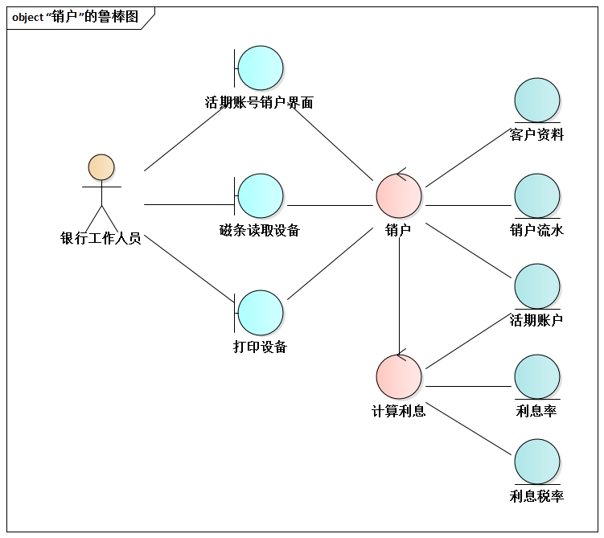

# 8.2. 鲁棒图简介

ADMEMS推荐以鲁棒图来辅助初步设计。那么，什么是鲁棒图呢？

## 8.2.1. 鲁棒图的3种元素

鲁棒图包含3中元素，它们分别是边界对象、控制对象、实体对象。

- 边界对象对模拟外包环境和未来系统之间的交互进行建模。边界对象负责接收外部输入，处理内部内容的解释，并表达或传递相应的结果。
- 控制对象对行为进行封装，描述用例中事件流的 控制行为。
- 实体对象对新鲜进行描述，它往往来自领域概念，和领域模型中的对象有良好的对应关系。

因为“类比思维”在人的头脑中是根深蒂固的，关于鲁棒图3元素的“类比”，自然是MVC。我们做了全面的对比，两者之间还是有不小的差异的。

鲁棒3元素和MVC的主要不同在于：

- View仅涵盖了“用户界面”元素的抽象，而鲁棒图的边界对象全面涵盖了三种交互，即本系统和外部“人”的交互、本系统与外部“系统”的交互、本系统与外部“设备”的交互。
- 数据访问逻辑Controller吗？不是。控制对象广泛涵盖了应用逻辑、业务逻辑、数据访问逻辑的抽象，而MVC的Controller主要对应于应用逻辑。
- MVC的Model对应于经典的业务逻辑部分，而鲁棒图的实体对象更像“数据”的代名词--用实体对象建模的数据既可以是持久化的，也可以仅存在内存中，并不像有的实践者理解的那样直接就等同于持久化对象。

## 8.2.2. 鲁棒性一例

如银行存储系统的“销户”功能的鲁棒图。

为了实现销户的功能，银行工作人员要访问3个边界对象：

- 活期账号销户界面
- 磁卡读取设备
- 打印设备

“销户”是一个“控制对象”，和“计算利息”一起进行销户功能的逻辑控制。

- 其中，“计算利息”对“活期账户”、“利息率”、“利息税率”这3个“实体对象”进行读取操作。
- 而“销户”负责读出“客户资料”......最终销户的完成意味着写入“活期账号”和“销户流式”信息。

## 8.2.3. 历史

鲁棒图(`Robustness Diagram`)是由[Ivar Jacobson](https://baike.baidu.com/item/Ivar%20Jacobson)于1991年发明的，用以回答“每个用例都需要哪些对象”的问题。

后来的`UML`并没有将鲁棒图列入到`UML`标准，而是作为`UML`版型（`stereotype`）进行支撑。

对于`RUP`、`ICONIX`等过程，鲁棒图都是重要的支撑技术。当然，这些过程反过来也促进了鲁棒图技术的传播。

## 8.2.4. 为什么叫“鲁棒”图

那为什么叫鲁棒图？它和鲁棒性有什么关系？

答案是：词汇相同，含义不同。

> 软件系统的”鲁棒性（Robustness）“也是经常被翻译成”健壮性“，它同时和”容错性(Fault Tolerance)“含义相同。具体而言，鲁棒性指当下发生时依然具有正确运行功能的能力：非法输入数据、软硬件单元出现故障、未料到的操作情况。

鲁棒图的作用有两点：

- 初步设计
- 检查用例规约是否正确和完善

> ”鲁棒图“正是因为第2点作用而得名的--所以，严格来讲”鲁棒图(Robustness Digagram)“所指的不是"鲁棒性(Robustness)"。

从Doug Rosenberg在[《用例驱动的UML对象建模应用》](https://book.douban.com/subject/1319739/)的描述中，也可得到上述结论：

> 在`ICONIX`过程中，鲁棒分析扮演了多个必不可少的角色。通过鲁棒分析，您将改进用例文本和静态模型。
>
> - 有助于区别用例文本的正确性，且没有指定不合理或不可能的系统行为（基于要使用的一组对象），从而提供了健康性检查（`Sanity Check`）。这种改进使用用例文本的特性从纯粹的用户手册角度变成对象模型上下文中的使用描述。
> - 有助于区别用例考虑到所有必须的分支流程，从而提供了完整的正确性检查。经验表明，为实现这种目标，并编写出遵循某些定义良好的指南的问题，而在绘制鲁棒图上花费的时间，将在绘制时序图时3-4倍的节省下来。
> - 有利于发现对象，这一点很重要，因为在建模期间肯定会遗漏一些对象。你还可以发现对象命名冲突的情况，从而避免进一步造成严重的问题。另外，鲁棒分析有利于确保我们在绘制时序图之前确定大部分实体类和边界类。

## 8.2.5. 定位

不要再困惑于类似”鲁棒图是分析技术，还是设计技术“这样的问题了。大家只需要记住两个公式：

- 需求分析 ≠ 系统分析
- 系统分析 ≈ 初步分析

关于”分析“和”设计“的区分，在《面向对象的系统设计》一书中早已做过进程的阐述：