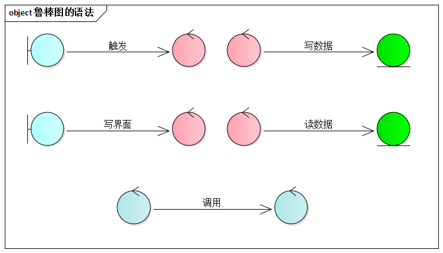

# 8.3. 基于鲁棒图进行初步设计的10条经验

ADMEMS方法归纳了鲁棒图建模的10条经验要点，分别覆盖了语法、思维、技巧、注意事项等4个方面。

**语法**

- 遵循建模规则
- 简化建模语言

**思维**

- 遵循3种元素的发现思路
- 增量建模
- 实体对象 ≠ 持久化对象

**技巧**

- 只对关键功能（用例）画鲁棒图
- 每个鲁棒图有2~5个控制对象

**注意**

- 勿关注细节
- 勿过分关注UI，除非辅助或验证UI设计
- 鲁棒图 ≠ 用例规约的可视化

## 8.3.1. 遵循建模规则

Doug Rosenberg在[《UML用例驱动对象建模》](https://book.douban.com/subject/1125856/)中写道：

> 通过以下4条语言，可以理解该图的本质：
>
> 1. 参与者只能与边界对象交谈。
> 2. 边界对象只能与控制对象和参与者交谈。
> 3. 实体对象也只能与控制对象交谈。
> 4. 控制对象既能与边界对象交谈，也能与控制对象交谈，但不能与参与者交谈。

## 8.3.2. 简化建模语法

在实践中，简化的鲁棒图语法将有利于你集中精力进行初步设计，而不是关注细节。

> 例如，鲁棒图根本不关心“IF语言”怎么建模。

值得注意的是，业界有些观点（包括一些书）认为鲁棒图是协作图。因此造成了鲁棒图的语法非常复杂，不利于专注于初步设计。

其实，鲁棒图是一种非常特殊的类图。

## 8.3.3. 遵循3种元素的发现思路

用例（`Use Case`） = N个场景（`Scenario`）。每个场景的实现都是一连串的职责进行协作的结果。所以，初步设计可以通过“研究用例执行的不同场景，发现场景背后应该有哪些不同的职责”来完成。

## 8.3.4. 增量建模

“建模难”，有些人常如此感叹。例如，在画鲁棒图时，许多人以上来就卡在了“搞不清应该有几个界面”的问题上，就会发出“建模难”的感叹。

