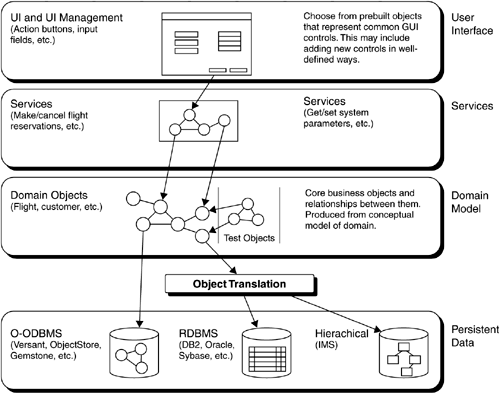

# 9.2. 分层式概念服务架构

人们常说，“分层式最流行的架构模式”。从字面上理解，这似乎意味着大家所进行的“分层”在思想层面上是一致的。但事实并非如此。在实践中，分层有不同的角度，并且互不矛盾。通常会总结为“3 + 1”流派。

- `Layer`：逻辑层
- `Tier`：物理层
- 按通用性分层
- 技术堆叠

## 9.2.1. Layer:逻辑层

逻辑层(`Layer`)重视职责的划分，职责之间常常是上层使用下层的关系--但是根本不关心上层和下层是否“能分布”在不同机器上。

> 图片来源：[Layered Business Architectures: Logical Structures](https://flylib.com/books/en/1.243.1.93/1/)

- 图中的`Services`层对下层`Domain Model`部分的访问，是一种跨机器的远程访问吗？

答案是：不知道，也不关心。整个架构图中的箭头表示的是逻辑上服务使用关系，而对物理角度是否是跨机器的访问方式并不关心。

按`Layer`分层 ≠ 按`Tier`分层。

- 图中的`User Interface`、`Services`、`Domain Model`和`Persistent Data`是通用性逐渐增加吗？（”通用性越大，所处层次就越靠下“是按通用性分层的常见方式。）

答案是：无法确定那一层更通用。例如，作为最下层的`Persistent Data`层本来支持硬盘，但后来要支持磁盘阵列，再后来要支持`SAN`（存储区域网络），这都要求存`Persistent Data`层要有针对性的进行改变。

按`Layer`分层 ≠ 按通用性分层。
